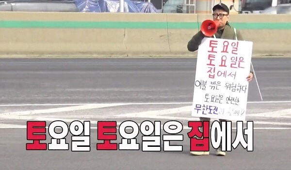

# 이미지 전처리

### 이미지 전처리 

앞에서 물었듯이 위 이미지의 크기는 얼마나 될까요? 아니 위 이미지는 얼마 만큼의 **정보**를 가지고 있을까요?

속성에 들어가 확인해보니 위 이미지 크기는 600 x 352\(pixel\) 이며 총 75.9KB\(77,788 바이트\)의 정보로 구성되어 있습니다. 단지 사진 한 장일 뿐인데 이렇게나 많은 정보가 담겨 있습니다. 이러한 이미지 데이터를 몇 십장 아니 몇 백 몇 천 장을 지금까지 공부 내용으로 학습을 시킨다고 생각해보세요. 잠깐만 생각해봐도 답이 없다는 걸 알 수 있습니다. .. 🤯 그렇다면 이런 이미지 데이터는 어떻게 사용해야 할까요? 

이미지를 분석하기 위해서는 목적에 맞게 \(이미지\)데이터를 가공해야 합니다. 이 과정을 **이미지 전처리** 라고 합니다. 

